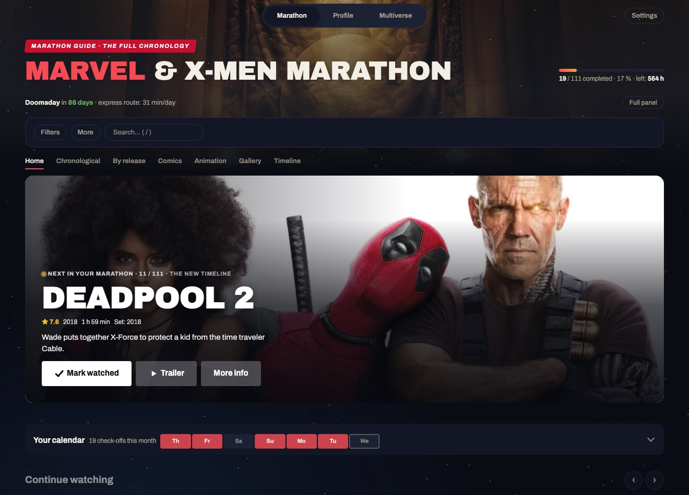
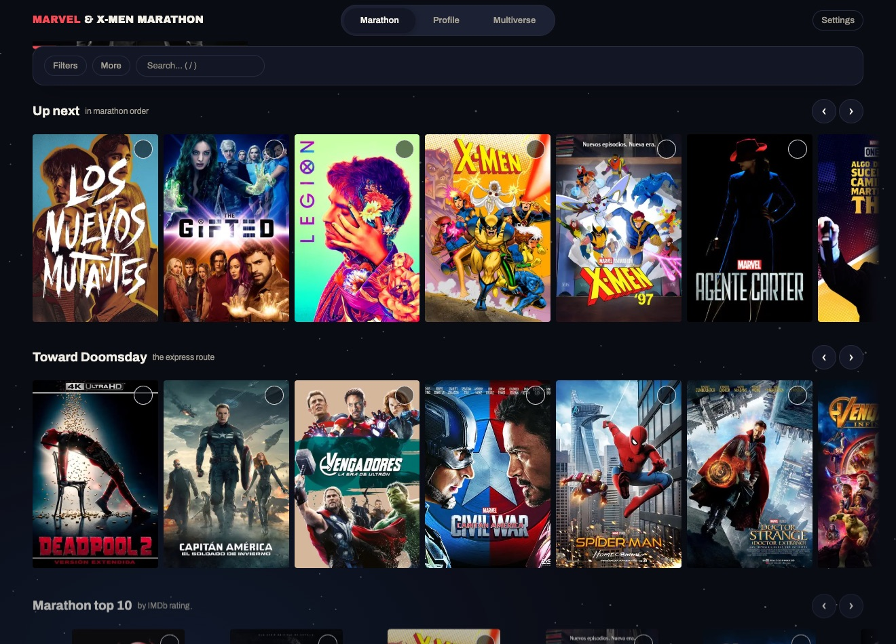
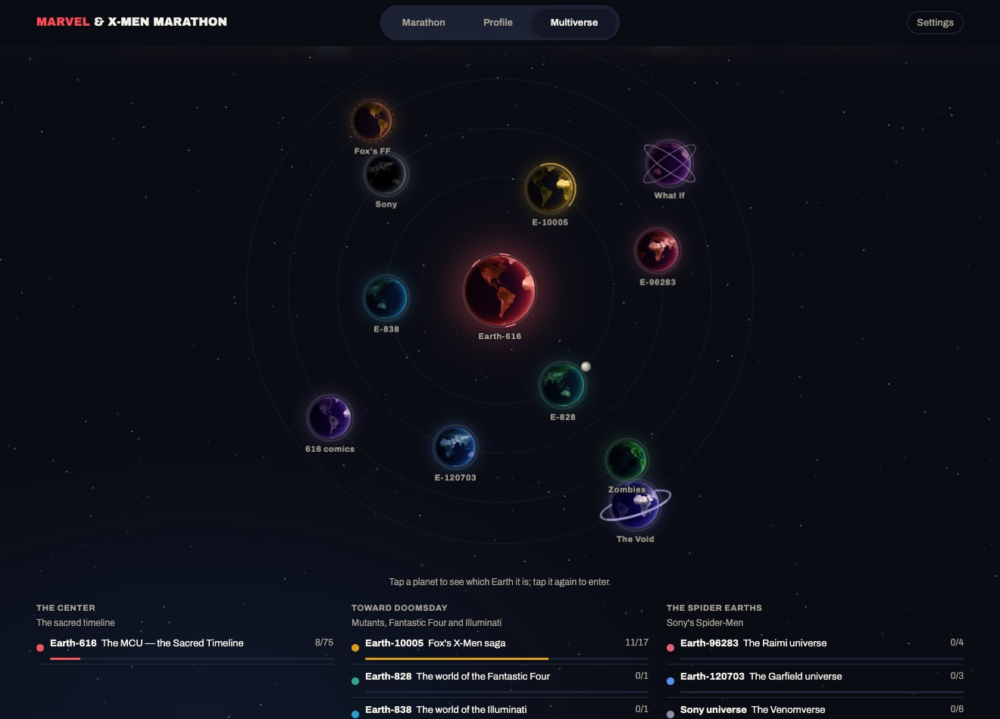
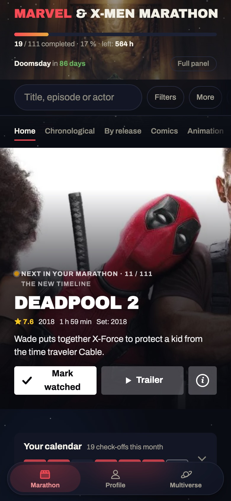
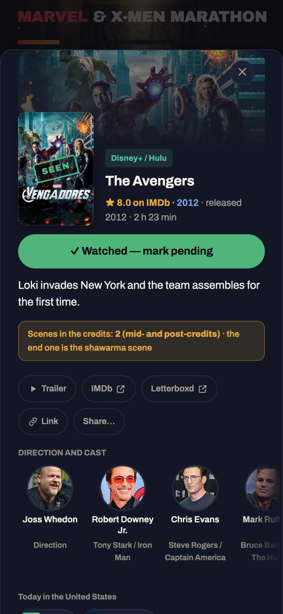
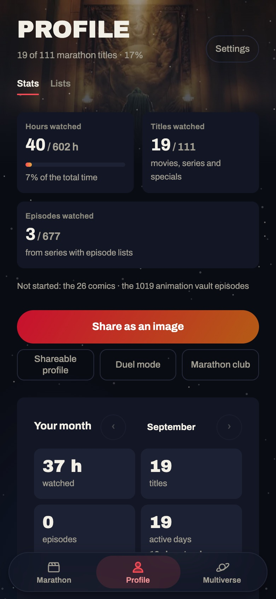

# 🍿 Marvel & X-Men Marathon

🇪🇸 [Leer en español](README.md)

**All of Marvel and X-Men, in the order the story happens.** Check off what you watch, see what's left, and be caught up for *Avengers: Doomsday* (December 18, 2026).

### ➡️ [Open the app: ssebv.github.io/maraton-marvel](https://ssebv.github.io/maraton-marvel/?lang=en)

Free, no ads, no account needed. The app follows your phone's language; you can switch between English and Spanish anytime in Settings.

---

## What you can do

🎬 **Follow the full marathon.** 140+ titles: MCU movies and shows, the Fox X-Men saga, essential comics and a vault of animated series. All in chronological order, reviewed with the community.

📺 **Check off episode by episode.** 1,600+ episodes, each with its still and a synopsis that stays blurred until you ask for it, so nothing gets spoiled.

🗓️ **Make a plan.** Tell it which days you watch and for how long, and the app builds your schedule, tells you what's up today and whether you'll make the premiere. You can add it to your calendar.

📍 **Know where to watch.** Every title shows which service has it in your country (19 countries, including the United States, Mexico and Spain), plus trailer, cast and post-credit scenes.

📚 **Read the comics.** Each comic tells you where to read it legally, and if you already own the file, you can open it inside the app.

🌌 **Explore the multiverse.** Marvel's Earths as a solar system, a map of connections and cards to browse.

🏆 **Track your progress.** Achievements, streaks, a calendar of what you've watched and a monthly recap.

🙈 **Spoiler-free mode.** Hides synopses, post-credit scenes and episode titles for everything you haven't watched yet.

🌎 **English and Spanish**, light and dark mode.

**On your phone:**

  
  
  

## Watch with friends

- **Share your profile** with a link so friends can see how far you are.
- **Duel mode**: paste a friend's profile link and see who's ahead.
- **Marathon club**: join with a code from a friend and compete on a leaderboard, with medals and comments on every title.
- **Coming soon, communities**: your own groups, forums for every movie and episode (spoilers hidden from anyone who hasn't watched it), challenges and following other people.

## Install it on your phone

It works like a regular app, with an icon and offline support:

- **iPhone (Safari):** Share button → *Add to Home Screen*.
- **Android (Chrome):** ⋮ menu → *Install app*.

Your progress is saved on your phone. From Settings you can back it up or move it to another device.

Questions? See the [**FAQ**](FAQ.md): how not to lose your progress, why this order, the bare minimum to be ready for Doomsday and more.

## Join in

This app gets better with the people who use it. Got something to say? [Open an issue here](https://github.com/Ssebv/maraton-marvel/issues/new/choose) (you'll need a free GitHub account). **English is welcome everywhere.**

- 🧭 **Does the order look off?** Tell us which title you'd move and why.
- 🐞 **Something broken?** Tell us what happened and on which phone or browser.
- 💡 **Got an idea?** A view, a challenge, a filter… anything goes.
- 📺 **Wrong streaming service in your country?** Tell us which one and where you saw it.
- 🌐 **Something still in Spanish, or an odd translation?** Tell us where; see [how the translation works](TRANSLATING.md).

Prefer to chat? In [**Discussions**](https://github.com/Ssebv/maraton-marvel/discussions) you can share theories, ask whether a show is worth it, pitch ideas or show off your marathon.

And if the app helps you, **share it** with anyone on the same marathon. The more people use it, the livelier the community will be when the forums open.

Before joining in, please read the [community guidelines](comunidad/normas.md) (in Spanish for now): no spoilers outside their place, always be respectful, no piracy.

---

A fan project, not affiliated with Marvel or Disney. Episode data from Wikipedia; posters, stills, cast and metadata from [TMDB](https://www.themoviedb.org/) (this product uses the TMDB API but is not endorsed or certified by TMDB). Streaming availability from [JustWatch](https://www.justwatch.com/) via TMDB. Curious how it's built? Technical notes (in Spanish) are in [DESARROLLO.md](DESARROLLO.md).
