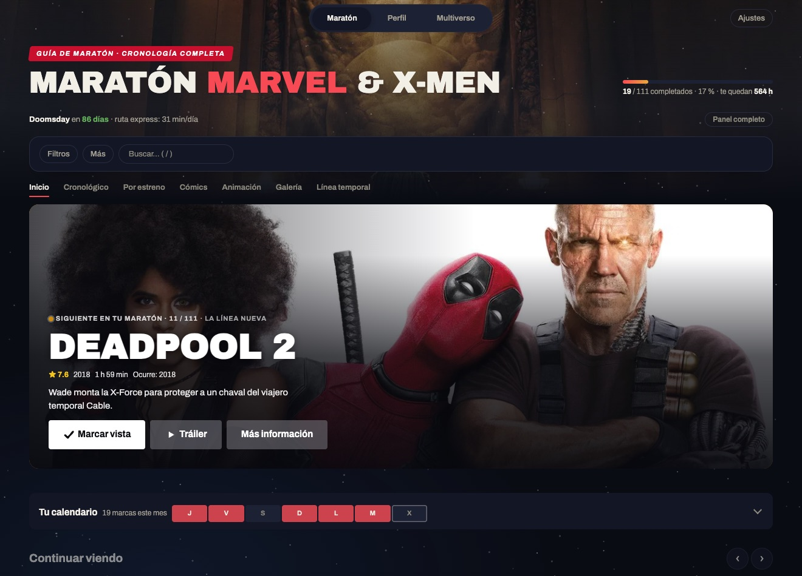
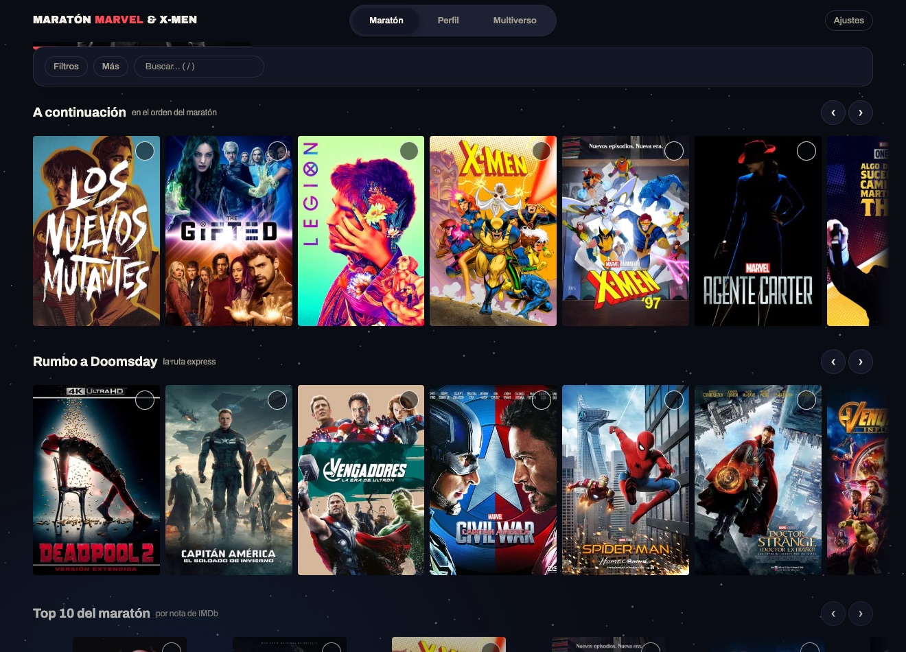
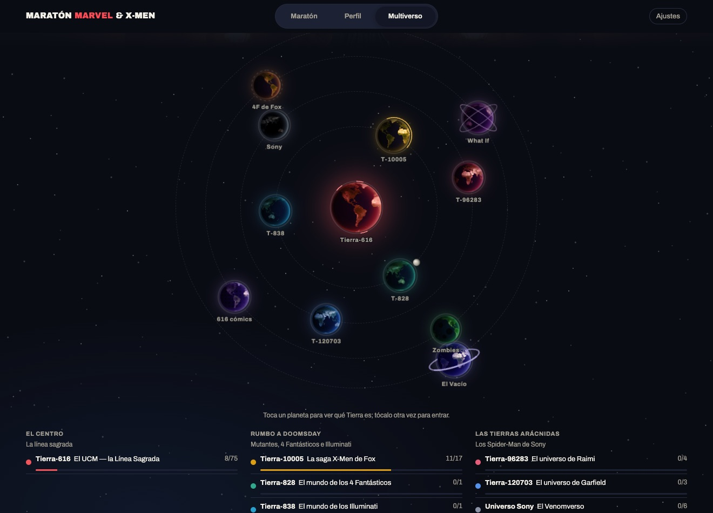
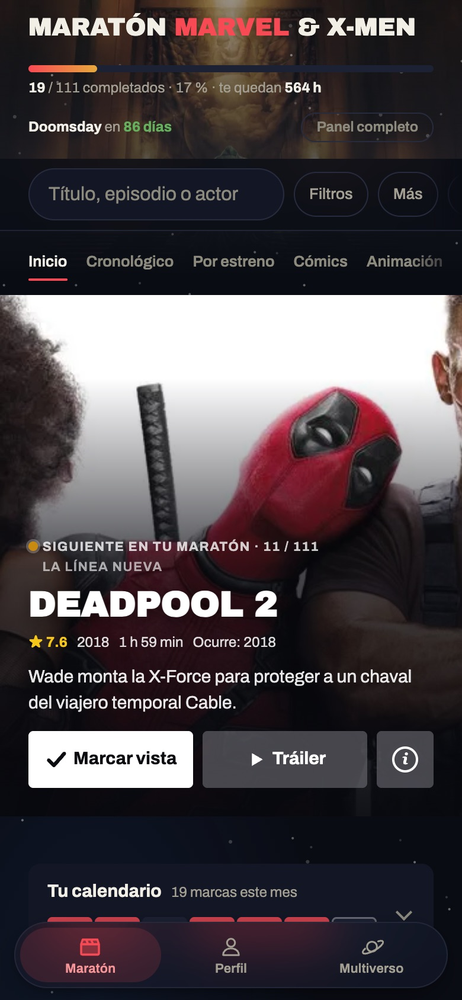
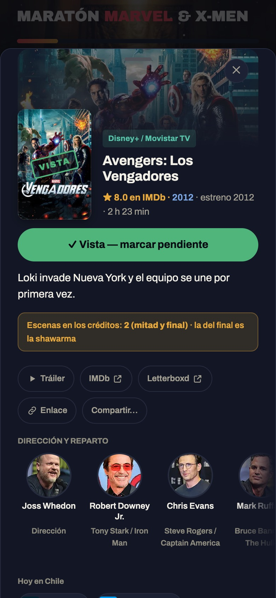
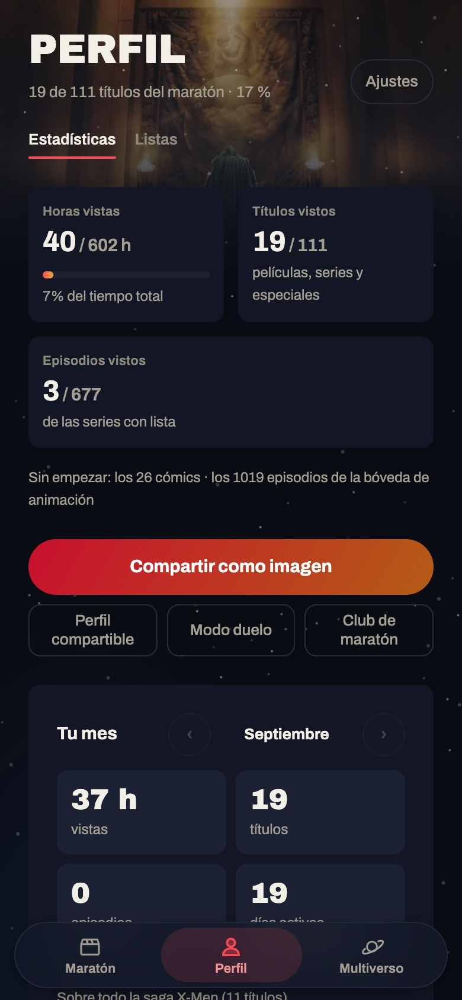

# 🍿 Maratón Marvel & X-Men

🇬🇧 [Read in English](README.en.md)

**Todo Marvel y X-Men, en el orden en que ocurre la historia.** Marca lo que vas viendo, descubre qué te falta y llega a *Vengadores: Doomsday* (18 de diciembre de 2026) al día.

### ➡️ [Abrir la app: ssebv.github.io/maraton-marvel](https://ssebv.github.io/maraton-marvel/)

Es gratis, no tiene anuncios y no hace falta crear cuenta.

---

## Qué puedes hacer

🎬 **Seguir el maratón completo.** Más de 140 títulos: las películas y series del UCM, la saga X-Men, los cómics esenciales y una bóveda de series animadas. Todo en orden cronológico, repasado con la comunidad.

📺 **Marcar episodio por episodio.** Más de 1.600 episodios, con su foto y una sinopsis que se queda borrosa hasta que la pides, para no comerte ningún spoiler.

🗓️ **Armar tu plan.** Dile cuántas horas tienes y qué días ves, y la app te arma el horario, te dice qué toca hoy y si llegas al estreno. Lo puedes pasar a tu calendario.

📍 **Saber dónde verla.** Cada título te dice en qué plataforma está en tu país (19 países, incluidos Chile, México, Argentina, Colombia, Perú y España), con tráiler, reparto y escenas post-créditos.

📚 **Leer los cómics.** Cada cómic dice dónde leerlo legalmente, y si ya tienes el archivo, lo puedes abrir dentro de la app.

🌌 **Explorar el multiverso.** Las distintas Tierras de Marvel en un sistema solar, un mapa de conexiones y tarjetas para recorrer.

🏆 **Ver tu avance.** Logros, rachas, tu calendario de lo que has visto y un resumen de tu mes.

🙈 **Modo sin spoilers.** Esconde sinopsis, escenas post-créditos y títulos de episodio de lo que aún no has visto.

🌎 **En español o en inglés**, con modo claro y oscuro.

**En el teléfono:**

  
  
  

## Verlo con amigos

- **Comparte tu perfil** con un enlace y que vean cuánto llevas.
- **Modo duelo**: pega el enlace del perfil de un amigo y compara quién va más adelante.
- **Club de maratón**: entra con el código que te pase un amigo y compitan en un ranking, con medallas y comentarios en cada título.
- **Próximamente, comunidades**: grupos propios, foros por película y episodio (sin spoilers para quien no lo ha visto), retos y seguir a otras personas.

## Instálala en tu teléfono

Funciona como una app normal, con ícono y sin conexión:

- **iPhone (Safari):** botón Compartir → *Agregar a pantalla de inicio*.
- **Android (Chrome):** menú ⋮ → *Instalar app*.

Tu progreso se guarda en tu teléfono. Desde Ajustes puedes sacar una copia o pasarlo a otro dispositivo.

¿Dudas? Mira las [**preguntas frecuentes**](PREGUNTAS-FRECUENTES.md): cómo no perder tu progreso, por qué va este orden, cuál es lo mínimo para llegar a Doomsday y más.

## Súmate

Esta app mejora con la gente que la usa. Si tienes algo que decir, [abre un aviso aquí](https://github.com/Ssebv/maraton-marvel/issues/new/choose) (necesitas una cuenta gratis de GitHub):

- 🧭 **¿El orden te parece raro?** Dinos qué título moverías y por qué.
- 🐞 **¿Algo no funciona?** Cuéntanos qué pasó y desde qué teléfono o navegador.
- 💡 **¿Se te ocurre una idea?** Una vista, un reto, un filtro… todo sirve.
- 📺 **¿Una plataforma de tu país está mal?** Avísanos cuál y dónde la viste.
- 🌐 **¿Algo sale en español con la app en inglés, o se tradujo raro?** Cuéntanos dónde. Si sabes inglés, aquí está [cómo se traduce](TRANSLATING.md).

¿Prefieres conversar? En las [**Discusiones**](https://github.com/Ssebv/maraton-marvel/discussions) puedes compartir teorías, preguntar si hace falta ver tal serie, proponer ideas o mostrar en qué va tu maratón.

Y si la app te sirve, **compártela** con quien esté en la misma maratón. Mientras más gente la use, más viva va a estar la comunidad cuando se abran los foros.

Antes de participar, dale una mirada a las [normas de la comunidad](comunidad/normas.md): nada de spoilers fuera de su sitio, respeto siempre y nada de piratería.

---

Proyecto de fans, sin relación oficial con Marvel ni Disney. Datos de episodios de Wikipedia; carátulas, fotogramas, reparto y metadatos de [TMDB](https://www.themoviedb.org/) (este producto usa la API de TMDB pero no está avalado ni certificado por TMDB). Disponibilidad por plataforma de [JustWatch](https://www.justwatch.com/) vía TMDB. ¿Quieres ver cómo está hecha? Las notas técnicas están en [DESARROLLO.md](DESARROLLO.md).
